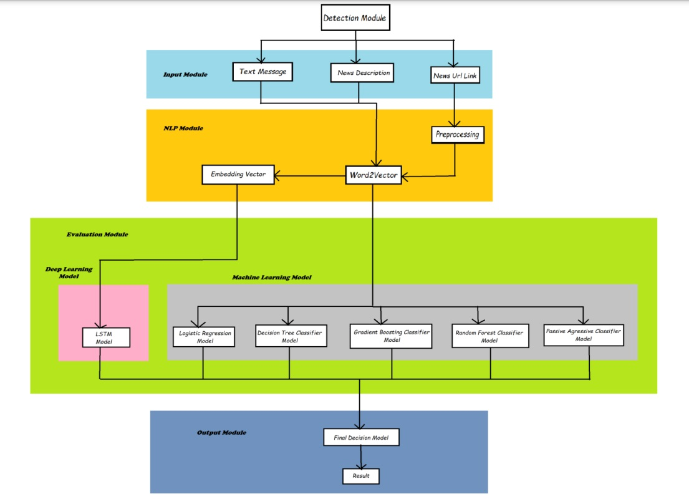

# FakeNewsDetectionApp

## Introduction

1. This application can be used to detect fake news, or false news, on social media and news websites.
2. We have shown some data analysis from our dataset that we have gathered from many online social media sites. 
3. We have also presented the main sources where fake news and true news originate. 
4. Our project is tangled with multiple models trained on our own and also some pre-trained models extracted from Felipe Adachi.
5. 
6. The accuracy of the model is around 95% for self-made models and 97% for pre-trained models. 
7. This model can detect all news and messages that are related to COVID-19, politics, geology, etc.

## Diagram


## Requirement
* run this script to install all libraries
```
pip install -r requirement txt
```
